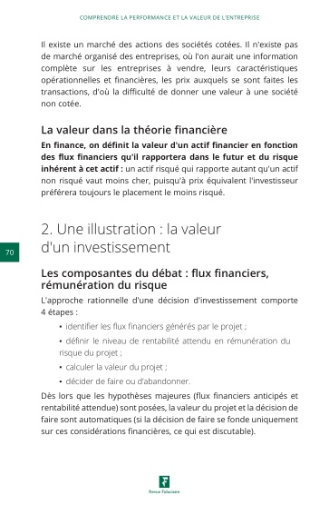
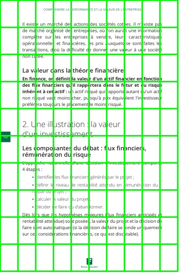
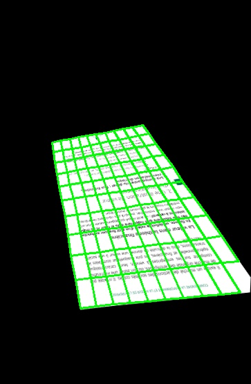
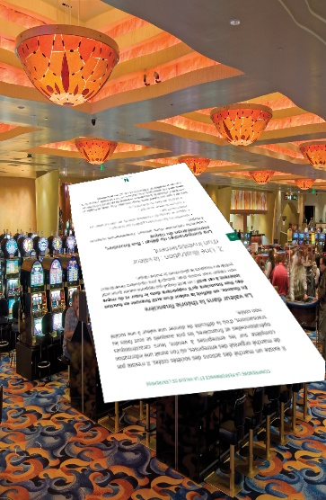
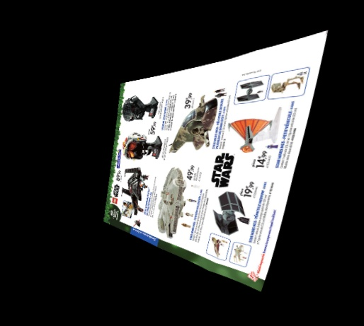
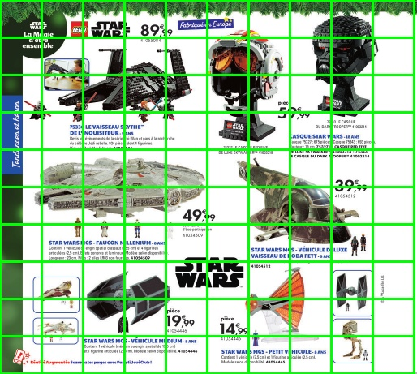
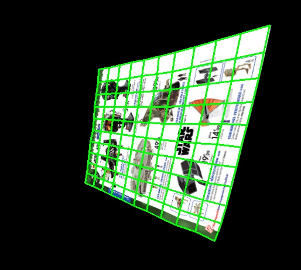
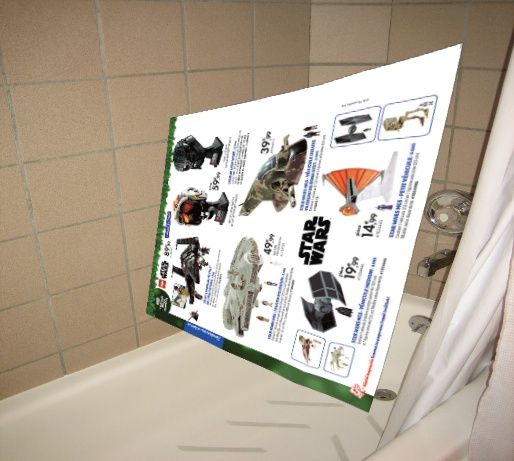

# Image Synthetic Creator

This repository contains a tool for creating synthetic data using a reference image as a base. It is designed to generate fake shots from this image by applying perspective transformations and mesh deformations.

## Features

- **Synthetic Data Generation**: Creation of fake shots from a reference image by applying perspective transformations and mesh deformations.
  
- **Data Saving**: For each generated image, the program saves a folder containing:
  - The initial reference image.
  - A folder containing all the generated synthetic images.
    - Image final
    - Image without background
    - Image Mask 
  - Associated data for each synthetic image, including:
    - Homography.
    - Initial mesh.
    - Projected image mesh.

## Usage

1. **Install Dependencies**: Make sure you have the necessary dependencies installed by running:
```
pip install -r requirements.txt
```

2. **Configuration**: Configure the settings according to your needs in the `config.yaml` configuration file.

3. **Execution**: Run the program with the following command:
```
python main.py --images --background --numbers --output
```

## Folder Structure

- `data/`: Directory containing input and output data.
  - `image_N/`: Directory containing reference images.
    - `image.jpeg` : Image reference
    - `images/`: Directory where synthetic images will be saved.
      - `image_0/`: Directory where synthetic image and data will be saved.
        - `data.json` : Data
        - `final.jpeg` : Image synthetic
        - `image.jpeg` : Image synthetic without background
        - `mask.jpeg` : Image mask
    .
    .
    .
    .
    
    - `image_N/`: Directory where synthetic image and data will be saved.
        - `data.json` : Data
        - `final.jpeg` : Image synthetic
        - `image.jpeg` : Image synthetic without background
        - `mask.jpeg` : Image mask

## Examples
| Image de Référence | Étape 1: Perspective Transformation | Étape 2: Mesh Deformation | Étape 3: Autres Transformations (si applicables) |
| --- | --- | --- | --- |
|  |  |  |  |
|  |  |  |  |


## Contributions

Contributions are welcome! Feel free to open an issue to discuss features you would like to add or submit a pull request.

